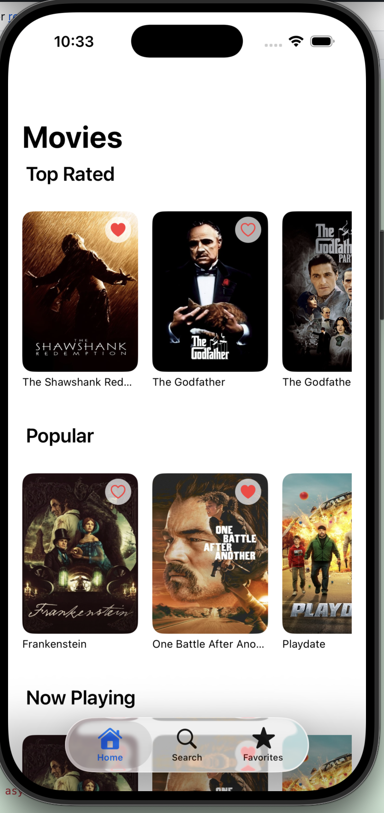
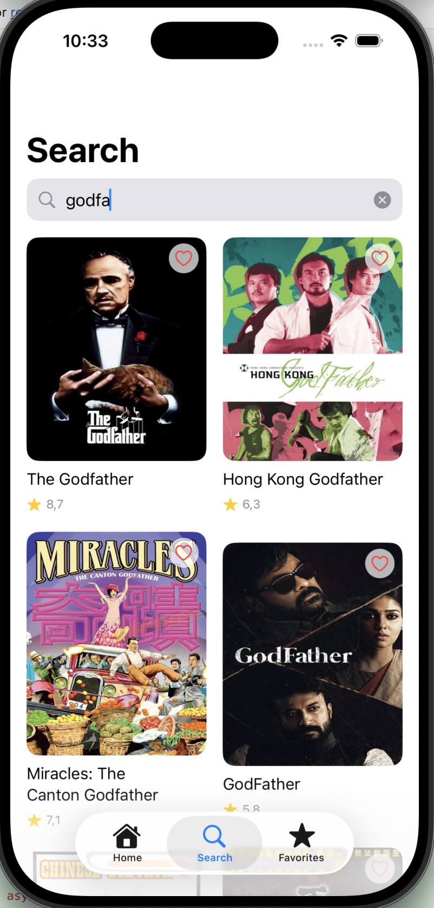

# 🎬 MovieDB iOS Uygulaması  
**SwiftUI · MVVM + Clean Architecture · Async/Await · Dependency Injection · Unit Tests**

Bu proje, modern iOS geliştirme pratiklerini öğrenmek ve uygulamak amacıyla oluşturulmuş **senior seviye** bir Movie DB uygulamasıdır.  
TMDB API kullanır ve tamamen **SwiftUI**, **Clean Architecture**, **async/await**, **memory image cache**, **Dependency Injection** ve **Unit Test** yapıları üzerine inşa edilmiştir.

---

## 🚀 Özellikler

### 🎞 Ana Sayfa (Home)
- Top Rated, Popular ve Now Playing bölümleri  
- Infinite scroll (sonsuz kaydırma)  
- Skeleton loading (shimmer effect ile)  
- Yatay carousel layout  
- Reusable `MovieCard` bileşenleri  

### 🔍 Arama (Search)
- Debounce destekli arama akışı  
- Modern grid tasarımlı sonuç ekranı  
- Favori ikonları ile anında güncelleme  
- Infinite scroll ile sayfalama  

### ⭐ Favoriler (Favorites)
- Global `FavoritesStore` (`EnvironmentObject`) ile favori yönetimi  
- Aşağıdaki ekranlardan favori ekleme/çıkarma:
  - Home
  - Search
  - Movie Detail
- Favoriler ekranı (Favorites screen)  
- Local storage için `UserDefaults` kullanımı  

### 📄 Film Detayı (Movie Detail)
- Poster + backdrop içeren hero header alanı  
- Oyuncu listesi (Cast)  
- Önerilen filmler (Recommendations)  
- Add / Remove Favorite desteği  
- Structured layout (Info, Cast, Recommendations bölümleri)

---

## 🏛 Mimari

Bu proje **MVVM + Clean Architecture** prensiplerine göre kurgulanmıştır.

```text
MovieApp
├── Domain
│   ├── Entities
│   ├── UseCases
│   └── Repository Interfaces
├── Data
│   ├── DTOs
│   ├── Mappers
│   ├── API Service
│   └── Repository Implementations
├── Presentation
│   ├── Screens
│   │   ├── Home
│   │   ├── Search
│   │   ├── MovieDetail
│   │   └── Favorites
│   ├── Components
│   ├── Helpers
│   └── ImageCache (MemoryCacheActor)
└── App
    ├── AppDIContainer
    └── MovieAppApp
```

**Katmanların sorumlulukları:**

- **Domain**  
  - İş kuralları, entity’ler, use case’ler ve repository protokolleri  
  - Platform bağımsız, framework bağımsız, tamamen test edilebilir katman

- **Data**  
  - Network DTO’ları, mapping işlemleri, API servisleri ve repository implementasyonları  
  - Domain ile API arasında köprü görevi görür

- **Presentation**  
  - SwiftUI ekranları, ViewModel’ler, global `FavoritesStore` ve UI yardımcıları  
  - Kullanıcıya gösterilen tüm akışların state yönetimi burada yapılır

- **App**  
  - `AppDIContainer` ile Dependency Injection
  - `MovieAppApp` ile SwiftUI giriş noktası ve `EnvironmentObject` bağlamaları

---

## 🧩 Dependency Injection

Tüm bağımlılıklar **AppDIContainer** üzerinden yönetilir:

- Repository instance’ları  
- API servisi (`APIService`)  
- UseCase factory’leri  
- ViewModel factory’leri  
- Global `FavoritesStore` (`EnvironmentObject`)  

Bu yaklaşım sayesinde:

- Test edilebilirlik artar  
- Bağımlılıklar merkezi bir noktadan kontrol edilir  
- Yeni feature eklemek kolaylaşır  
- Clean Architecture ile uyum korunur  

---

## 🎞 Image Cache

Uygulamada performans için özel bir **MemoryCacheActor** kullanılır:

- Tamamen thread-safe  
- Swift Concurrency ile uyumlu (actor tabanlı)  
- Async image loading ile birlikte çalışır  
- Özellikle Home ve Search ekranlarında kayda değer performans kazancı sağlar  

---

## 🧪 Unit Testler

Projede aşağıdaki ana bileşenler için unit testler yazılmıştır:

### ✔ FavoritesStoreTests  
- `load()` ile favorilerin yüklenmesi  
- `toggle()` ile favori ekleme/çıkarma davranışı  
- `isFavorite()` kontrolü  
- `MockFavoritesRepository` ile izole testler

### ✔ MovieDetailViewModelTests  
- `loadDetail()` başarı ve hata senaryoları  
- `loadCredits()` ile cast yükleme  
- `loadRecommendations()` ve sayfalama davranışı  
- State yönetimi (`MovieDetailState`)  
- `MockMovieRepository` ile izole testler  

### ✔ HomeViewModelTests  
- `loadInitialData()` ile üç listeyi (Top Rated, Popular, Now Playing) aynı anda yükleme  
- Sayfalama (pagination) testleri (`loadMoreTopRated`, `loadMorePopular`, `loadMoreNowPlaying`)  
- Hata senaryolarının state’e yansıması  

> Not: Genişletilebilir yapı sayesinde SearchViewModel, repository’ler veya ek use case’ler için de kolayca yeni testler eklenebilir.

Tüm testler:

- `async/await` yapısına uygun  
- `@MainActor` ile Swift 6 concurrency kurallarına uyumlu  
- Mock repository ve dummy data ile izole şekilde çalışır

---

## 🔧 Kurulum: TMDB API Key (XCConfig Yapılandırması)

Projede API anahtarlarını source control’e koymamak için **Debug.xcconfig** ve **Release.xcconfig** kullanılır.

### 1️⃣ Config klasörü oluştur  
Proje kök dizininde bir `Config` klasörü oluşturun:

```text
MovieApp/Config
```

### 2️⃣ Debug.xcconfig içine TMDB key ekle

`Config/Debug.xcconfig` dosyasına:

```text
TMDB_API_KEY = <your_tmdb_key_here>
```

Aynı şekilde `Release.xcconfig` içine de uygun değeri ekleyebilirsiniz.

### 3️⃣ Xcode Build Settings’te .xcconfig dosyalarını bağla

- **Project Navigator** → Projenize tıklayın  
- **Info** sekmesine geçin  
- Debug ve Release configuration’larını `Debug.xcconfig` ve `Release.xcconfig` ile eşleştirin

### 4️⃣ Info.plist içinde TMDB_API_KEY kullanımı

`Info.plist` içine:

```xml
<key>TMDB_API_KEY</key>
<string>$(TMDB_API_KEY)</string>
```

Bu sayede:

- API key’leriniz GitHub’da görünmez  
- Farklı ortamlar (Debug/Release) için farklı key kullanabilirsiniz

---

## 📱 Uygulama Ekran Görüntüleri

### 🎬 Ana Sayfa


### 📄 Film Detay


### 🔍 Arama

```

---

## 📦 Kullanılan Teknolojiler

- **SwiftUI**
- **Async/Await (Swift Concurrency)**
- **MVVM + Clean Architecture**
- **URLSession ile Networking**
- **XCConfig ile yapılandırma yönetimi**
- **Actor tabanlı Memory Image Cache**
- **Dependency Injection (AppDIContainer)**
- **Unit Tests (XCTest)**

---

## 👨‍💻 Geliştirici Notları

Bu proje aşağıdaki amaçlarla geliştirilmiştir:

- Senior seviye iOS mimarisi pratiği  
- Test odaklı geliştirme (TDD’ye uygun yapı)  
- Swift Concurrency (async/await, actor) konularını gerçek projede uygulama  
- SwiftUI ile state, navigation ve DI yönetimini derinlemesine öğrenme  

---

## 📝 Lisans

Bu proje kişisel öğrenim ve portföy amacıyla hazırlanmıştır.

## 👨‍💻 Geliştirici  
**Barış Görgün**  
iOS Developer  

[GitHub](https://github.com/barisgorgun) •  
[LinkedIn](https://www.linkedin.com/in/baris-gorgun-857572103/) 

## 🌍 Diller

[🇬🇧 For English, click here](README.md)

---

<p align="center">
  Made with ❤️ by <a href="https://github.com/barisgorgun">Barış Görgün</a>
</p>
